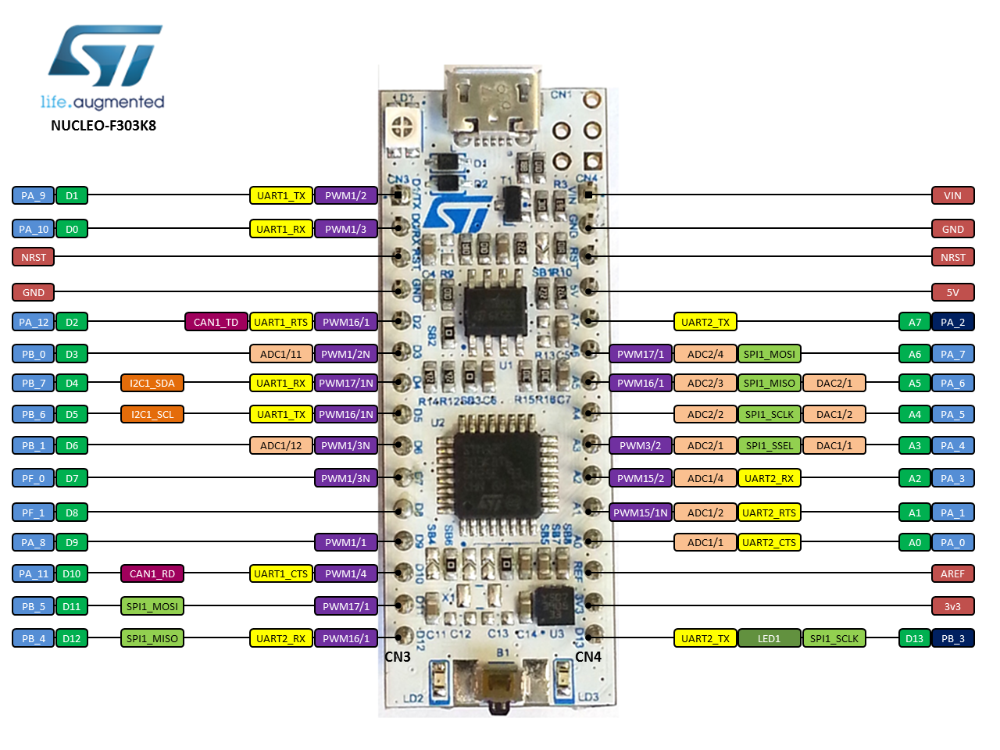

# STM32 Blink

Instructions followed: https://github.com/glegrain/STM32-with-macOS/tree/master

Notes:

- `arm-none-eabi-gcc` installed via `homebrew install  --cask gcc-arm-embedded`
- Boilerplate generated with STM32CubeMX (Toolchain: Makefile)
    - Didn't change anything in any tabs
    - Makefile worked out-of-the-box
    - project settings are stored in an `.ioc` file

## Pinout



## Config

Pins were initially configured using STM32CubeMX.

So for instance, Pin 5 (PA5) was configured for PWM (timer 2, channel 1) in STM32CubeMX, resulting in:
- the `stm32_blink.ioc` config file being updated:
- the `stm32f3xx_hal_msp.c` file being updated with some setup code

Afterwards, to change PWM duty cycle in a more precise manner, using interrupts, Claude updated the `stm32f3xx_hal_msp.c` file with some setup code for the timer that drives the interrupt callback, the `stm32f3xx_it.c` file with some code that actually enables the interrupt handler, and of course the `main.c` with the handler itself.

At this point, the `.ioc` config file is out of sync with the `.c` files, but it seems that Claude was also able to update the config file from looking at the `.c` files.

## Circuit


## Compiling/running

```
$ make clean && make && st-flash write ./build/*.bin 0x08000000 &&  st-flash --format ihex write ./build/*.hex
```

- Copied some source code from STM32-with-macOS repo for blink logic
- Claude fixed issues with GPIO config (see git log)

Tested on the STM32F303 Nucleo-32 (STM32F303K8T6)

Good overview: https://www.youtube.com/watch?v=Hffw-m9fuxc&t=454s&ab_channel=MitchDavis